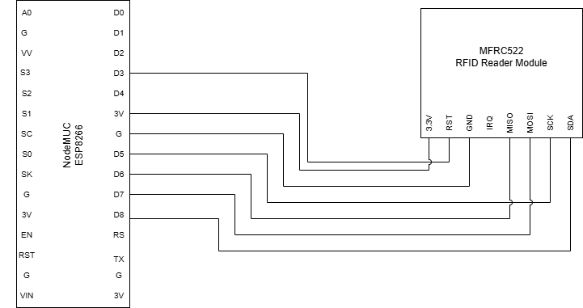

# RFID-Based-Attendance-System
An RFID Attendance System that records employee attendance via NodeMCU + MFRC522, managed through a Java desktop application.

# Description
A Java desktop-based application for administrators that automates attendance tracking using RFID technology. When an employee scans their RFID card, the NodeMCU + MFRC522 sends a POST request to a .php script, which updates the database. The admin can then view attendance data in the Java GUI application, which verifies the scan and shows whether it was valid.

# Features
- **Java desktop app for admins to manage and view attendance**
- **Automatic RFID-based attendance marking with real-time validation**
- **Calculates the total worked hours for each employee.**
- **Email notifications to employees**
- **Salary prediction based on past attendance**

# Hardware Requirements
- **NodeMCU (ESP8266)**
- **MFRC522 RFID Reader**
- **RFID Cards/Tags**

# Installation and Setup
1. Connect the MFRC522 RFID reader to the NodeMCU (refer to the code for pin assignments).
2. Install Arduino IDE, add the NodeMCU board package, and install required libraries (MFRC522, ESP8266WiFi, HttpCLient).
3. Upload the code to the NodeMCU.
4. Set up PHP and MySQL.
5. Test by scanning an RFID card to confirm proper logging in the database.
   
**Note:** After uploading the code, you can monitor the RFID scan outputs (valid/invalid) via the Arduino Serial Monitor or CoolTerm. This helps in verifying that the NodeMCU is sending data correctly to the PHP backend.
   
# Pin Connections
| MFRC522 Pin | NodeMCU 522 Pin | Purpose |
|-------------|-----------------|----------|
| RST | D3 | To reset or power down the MFRC522 module |
| 3v3 | 3V | Power Supply |
| GND | G  | Common ground connection |
| SCK | D5 | Clock signal for SPI communication |
| MISO | D6 | Used to receive data from the MFRC522 to NodeMCU|
| MOSI | D7 | Used to send data from the NodeMCU to MFRC522 |
| SDA (SS) | D8 | Select the RFID module for SPI communication |

# Java Libraries Used
- MySQL Connector/J (mysql-connector-java-9.2)
- JavaMail API (javax.mail)
- JCalendar (JCalendar-1.4.jar) 
- Activation (activation-1.1.1.jar)

# Configuration Notes

Before running the system, make sure to update the following according to your setup:

1. **Java Desktop Application (`AppConfig.java`)**  
   - `DB_URL`, `DB_USERNAME`, `DB_PASSWORD` → Database connection.  
   - `adminUsername`, `adminPassword` → Admin credentials (hard-coded).  
   - `senderEmail`, `appPassword` → Email settings for AttendanceMailer.java.

2. **Arduino / NodeMCU Code**  
   - WiFi SSID and password.  
   - Server IP.  
   - PHP server URL for POST requests.

3. **PHP / MySQL (`db_config.php`)**  
   - Update `DB_SERVER`, `DB_USERNAME`, `DB_PASSWORD`, `DB_NAME` and 'DB_TIMEZONE' according to your database setup.

# Demo Data
To quickly test the system, we have included a sample database dump:

- Folder: `demo_data`
- Contains:
  - 3 sample employees
  - Attendance records for the months **April to July**

# Usage
## Employee
1. Scan RFID Card: Employee scans their RFID card.

2. Read & Send Data: RFID reader captures the tag ID and NodeMCU sends it to the PHP backend.

3. Validate Tag
   - **Valid tag:**
        - **Time-In:** If no record exists and time is 10:00–11:00 → record Time-In; otherwise show invalid time message.
        - **Time-Out:** If Time-In exists and Time-Out not recorded → enforce 10-min wait, then record Time-Out and calculate worked hours; if already clocked out → show message.

    - **Invalid tag:** 
        - Ignore and show “RFID not found.

4.Repeat Process: System continuously listens for new scans and updates attendance.

## Admin  
1. Open the Java desktop application.
2. Log in with admin credentials.
3. View employee details.
4. View attendance records.
5. Export attendance sheets as CSV files.
6. Send attendance reports to employee emails.
7. Update and modify employee details.

